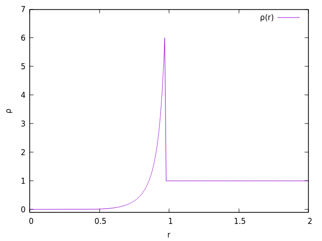

Sedov Blast Wave
====
> 3D spherical point-like blast.

Fortran implementation to calculate the analytical solution for the Sedov blast wave problem (point-like blast) in the standard case ($\gamma < 7$).

<figure>
  
  <figcaption>Fig.1 - Results of the &gamma;=1.4, uniform density test case at t=1. </figcaption>
</figure>

## References

1. L.I. Sedov, Similarity and Dimensional Methods in Mechanics, Academic Press, New York, NY, p. 147 ff. (1959).
2. J.R. Kamm, Evaluation of the Sedov-von Neumann-Taylor Blast Wave Solution, Los Alamos National Laboratory, (2000).
